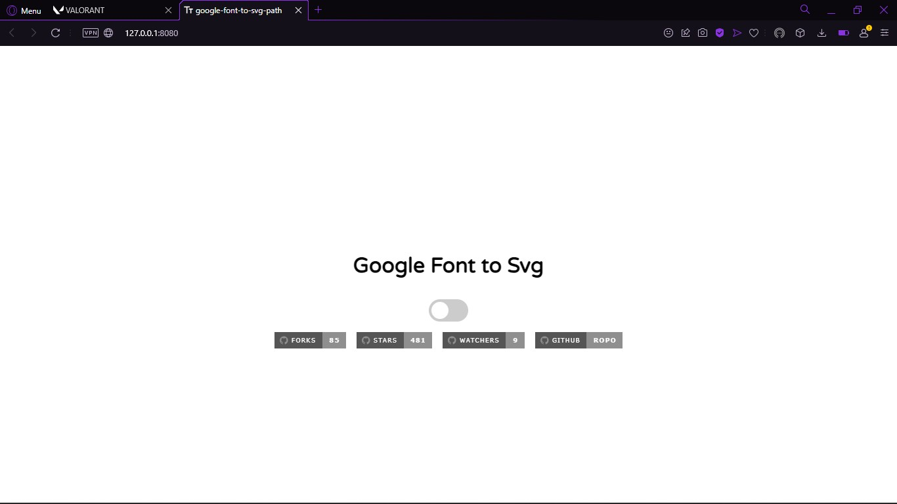
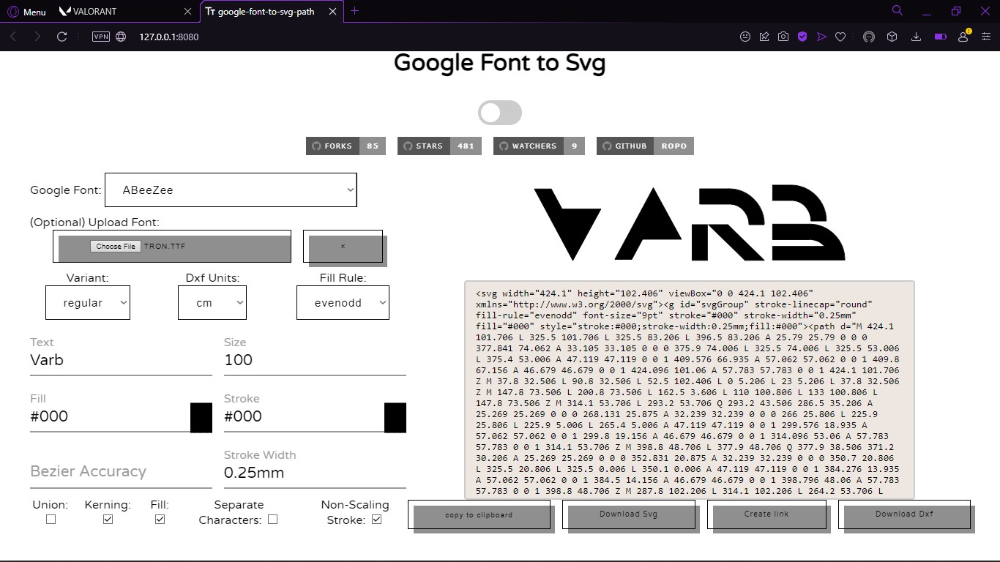
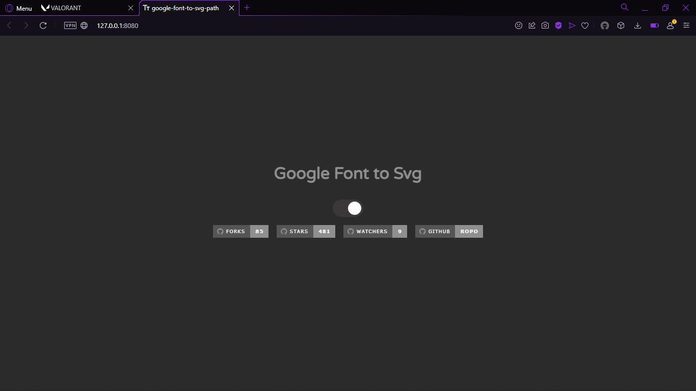
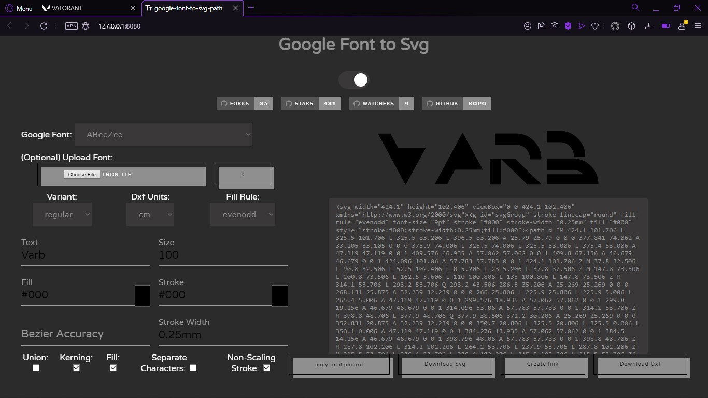

<h1 align="center">Google-font-to-svg-path</h1>
<h2 align="center">Create an SVG path from a Google font</h2>

<h1 align="center">Images</h1>

<h1 align="center">Website</h1>

<a href="https://danmarshall.github.io/google-font-to-svg-path">[Website]</a>

<h1 align="center">LICENSE</h1>

<a href="https://github.com/sadhukhanr/text-to-svg/blob/master/LICENSE">[MIT]</a>

